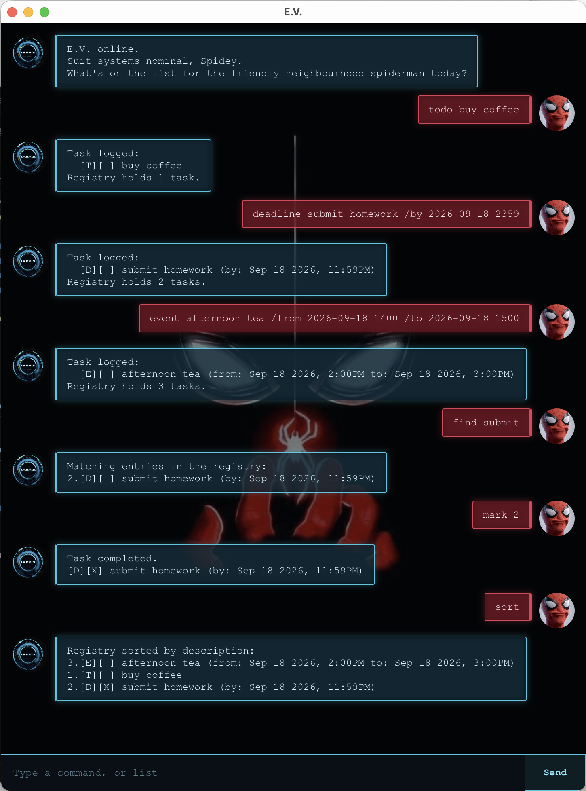

# E.V. User Guide

E.V. is a desktop assistant that tracks your tasks and remembers them between
sessions. You talk to it by typing commands into a chat window.



## Quick start

1. Check you have Java 25 installed by running `java -version`.
2. Download `ev.jar` from the [latest release](https://github.com/aerodart/ip/releases).
3. Put the jar in an empty folder, open a terminal in that folder, and run:

```
java -jar ev.jar
```

E.V. creates `data/ev.txt` next to the jar to remember your tasks, so launch it
from the same folder each time.

## Command summary

Words in `UPPER_CASE` are values you supply. Commands are lower case.

| Command | Format |
|---|---|
| Add a todo | `todo DESCRIPTION` |
| Add a deadline | `deadline DESCRIPTION /by yyyy-MM-dd HHmm` |
| Add an event | `event DESCRIPTION /from yyyy-MM-dd HHmm /to yyyy-MM-dd HHmm` |
| List all tasks | `list` |
| Mark as done | `mark TASK_NUMBER` |
| Mark as not done | `unmark TASK_NUMBER` |
| Delete a task | `delete TASK_NUMBER` |
| Search | `find KEYWORD` |
| Sort by description | `sort` |
| Show the command list | `help` |
| Exit | `bye` |

## Adding a todo

Adds a task with no date attached.

```
todo buy coffee
```

```
Task logged:
  [T][ ] buy coffee
Registry holds 1 task.
```

## Adding a deadline

Adds a task due at a given date and time. Dates use the format `yyyy-MM-dd HHmm`.

```
deadline submit homework /by 2026-09-18 1800
```

```
Task logged:
  [D][ ] submit homework (by: Sep 18 2026, 6:00PM)
Registry holds 2 tasks.
```

## Adding an event

Adds a task that runs between two date-times.

```
event buy tea /from 2026-09-20 1400 /to 2026-09-20 1600
```

```
Task logged:
  [E][ ] buy tea (from: Sep 20 2026, 2:00PM to: Sep 20 2026, 4:00PM)
Registry holds 3 tasks.
```

## Listing tasks

```
list
```

```
Current task registry:
1.[T][ ] buy coffee
2.[D][ ] submit homework (by: Sep 18 2026, 6:00PM)
3.[E][ ] buy tea (from: Sep 20 2026, 2:00PM to: Sep 20 2026, 4:00PM)
```

## Marking a task as done

```
mark 2
```

```
Task completed.
[D][X] submit homework (by: Sep 18 2026, 6:00PM)
```

## Marking a task as not done

```
unmark 2
```

```
Task reopened.
[D][ ] submit homework (by: Sep 18 2026, 6:00PM)
```

## Finding tasks

Lists every task whose description contains the keyword. Case is ignored, so
`find coffee` also matches `Buy Coffee`. Status icons, type tags and dates are
not searched. The keyword cannot be left out.

Each result keeps its registry number, so you can pass the number shown straight
to `mark`, `unmark` or `delete`.

```
find buy
```

```
Matching entries in the registry:
1.[T][ ] buy coffee
3.[E][ ] buy tea (from: Sep 20 2026, 2:00PM to: Sep 20 2026, 4:00PM)
```

## Sorting tasks

Lists every task ordered alphabetically by description, ignoring case. The
stored order is not changed.

The numbers are registry positions, not a fresh count, so after a sort they will
not run in order. That is deliberate: the number shown is the one `mark`,
`unmark` and `delete` accept.

```
sort
```

```
Registry sorted by description:
1.[T][ ] buy coffee
3.[E][ ] buy tea (from: Sep 20 2026, 2:00PM to: Sep 20 2026, 4:00PM)
2.[D][ ] submit homework (by: Sep 18 2026, 6:00PM)
```

## Deleting a task

```
delete 1
```

```
Task removed:
  [T][ ] buy coffee
Registry holds 2 tasks.
```

## Getting the command list

Prints every command E.V. understands and the format of each.

```
help
```

## Exiting

```
bye
```

## When something goes wrong

E.V. refuses input it cannot act on rather than guessing or silently ignoring it.
Nothing below changes your tasks, so a mistyped command is always safe to retry.

**Commands**

| You type | E.V. says |
|---|---|
| `fly` | I'm sorry Spidey, but this command seems to be outside my current scope. Try again. |
| `FLY` | the same. Commands are lower case |
| *(nothing)* | No command entered. |
| `sort buy` | The sort command takes no extra words. |

`list`, `sort`, `help` and `bye` take no arguments. Extra words are refused so a
command that did nothing never looks as though it worked.

**Task numbers**

| You type | E.V. says |
|---|---|
| `mark 0`, `mark 99` | No task with that number. |
| `mark abc`, `mark` | Task number must be a number. |

**Missing parts of a command**

| You type | E.V. says |
|---|---|
| `todo` | A todo needs a description. |
| `deadline x` | A deadline needs a description and a /by time. |
| `event x` | An event needs a description and a /from time. |
| `event x /from 2026-09-18 1400` | An event needs a /to time. |
| `find` | Tell me what to search for. |

**Dates and descriptions**

| You type | E.V. says |
|---|---|
| `deadline x /by Sunday` | Dates must look like 2026-09-18 1800. |
| `deadline x /by 2026-02-30 1800` | the same. The date does not exist |
| `deadline x /by 2026-09-18 2400` | the same. There is no hour 24 |
| `todo a \| b` | Descriptions cannot contain '\|'. It separates fields in my memory banks. |
| `event x /from 2026-09-20 1600 /to 2026-09-20 1400` | An event cannot end before it starts. |

Dates are checked against the real calendar. `2026-02-29` is refused because 2026
is not a leap year, while `2024-02-29` is accepted.

**The data file**

| Situation | E.V. says |
|---|---|
| A line in `data/ev.txt` is damaged | Warning: 1 damaged entry in my memory banks was left out. |
| The file cannot be read | I could not read my memory banks. |
| The file cannot be written, e.g. it is read-only | I could not write to my memory banks. |

A damaged line costs you that entry only. Every task E.V. can still read is kept,
and the file is not rewritten until a command actually changes the registry.

## Saving

Tasks are saved to `data/ev.txt` whenever you change the registry, and reloaded
on startup, so nothing needs to be saved by hand. Commands that only read the
registry, such as `list`, `find` and `sort`, leave the file untouched.

If a line in the data file has been damaged, E.V. skips that line, tells you how
many it left out, and keeps every task it could still read.

## Acknowledgements

- The JavaFX GUI scaffolding is adapted from the SE-EDU JavaFX tutorial:
  <https://se-education.org/guides/tutorials/javaFx.html>
  This covers `Main`, `Launcher`, `DialogBox` including its `fx:root` construction
  and `flip()` method, the FXML view skeletons, and the Gradle shadow-jar setup.
- The project skeleton is forked from the CS2103T iP template:
  <https://github.com/NUS-CS2103-AY2627-S1/ip>
- Artwork is third-party and used here solely for this project. None of it is original work. The sources are:
  - Chat background, from peakpx:
    <https://www.peakpx.com/en/hd-wallpaper-desktop-gobwf>
  - E.V.'s avatar, a J.A.R.V.I.S. interface, via ScreenRant:
    <https://screenrant.com/spider-man-homecoming-jarvis/>
  - The user's avatar, a frame from a Spider-Man GIF on Tenor:
    <https://tenor.com/en-GB/view/spider-man-gif-5310236965465327623>
- Claude (Anthropic) was used throughout this project as a coding
  assistant for reviewing code and testcases, diagnosing bugs and drafting parts of the documentation. All output was reviewed, tested and revised by me before being
  committed.
